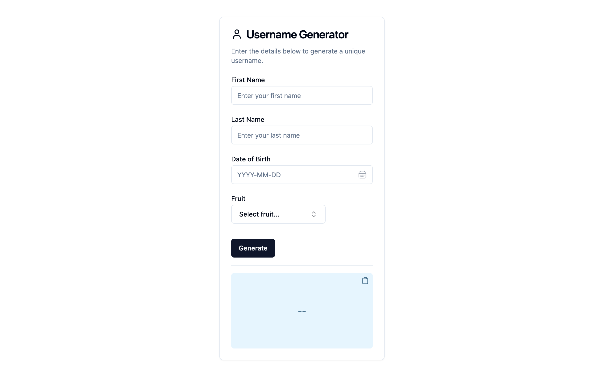

# Username Generator

An app that generates a username from a user's profile details.

## Description

This app was built with React on the frontend, and Node and Express on the backend. It uses Tailwind for styling and shadcn/ui for the base component library. It also uses React TailwindCSS DatePicker for the date picker input.

## Getting Started

### Run with Docker

To run with docker:

```
docker compose up -d
```

Then visit http://localhost:5173 to visit the frontend. Visit http://localhost:3000/api-docs/ to visit the Swagger docs for the backend.

## Run Locally

### Dependencies

- Node v20
- Docker (optional)
- Docker Compose (optional)

### Installing

To install the dependencies for the backend:

```
cd backend
npm install
```

To install the dependencies for the frontend:

```
cd frontend
npm install
```

### Set up environment variables

Before running the program, prepare the environment variables:

```
cd backend
cat .env.example >> .env
```

```
cd frontend
cat .env.example >> .env
```

### Executing the program

To run the backend in the dev mode:

```
cd backend
npm run dev
```

Or build it and run in production mode:

```
cd backend
npm run build
npm start
```

Then visit http://localhost:3000 to get a response from the backend.

To run the frontend in the dev mode:

```
cd frontend
npm run dev
```

And in production mode:

```
cd frontend
npm run build
npm run preview
```

Then visit http://localhost:5173 to get a response from the backend.

## Documentation

There are Swagger docs available for the backend. After running the backend, visit http://localhost:3000/api-docs/
